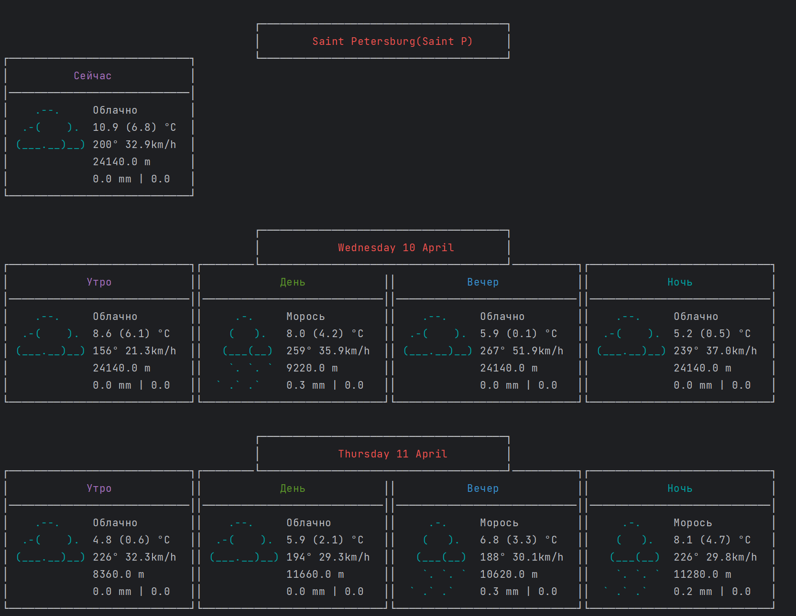
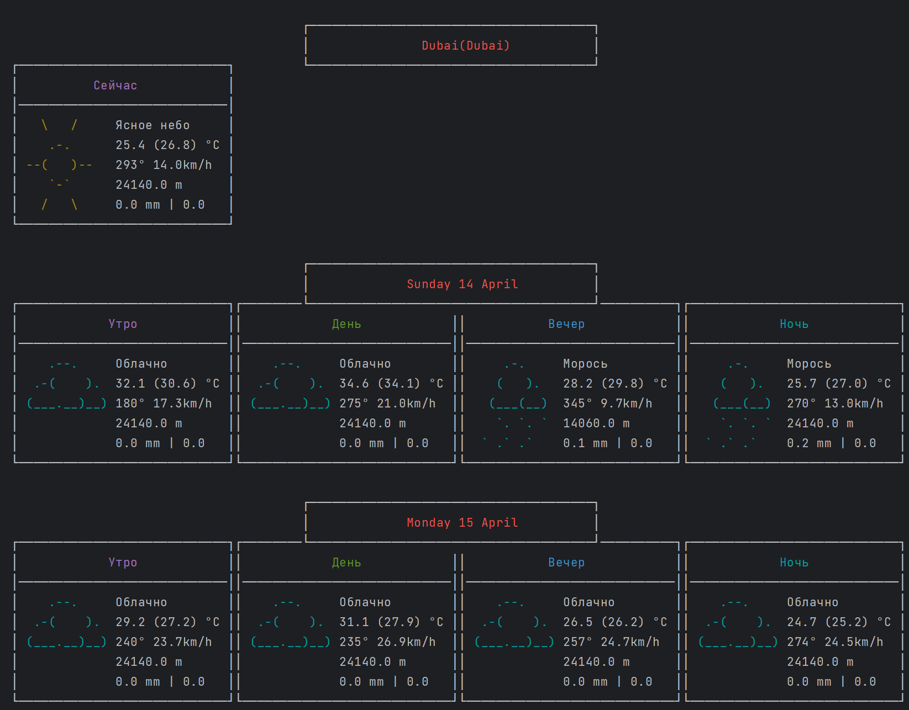

## Консольное приложение, отображающее прогноз погоды для выбранного списка городов.

## Интерфейс
<p float="left">
  
  
</p>

## Управление

- В качестве аргумента следует передать путь к .json файлу через флаг --config=
  ```{
  "cities": [
  "Saint P",
  "Moscow",
  "Dubai"
  ],
  "frequency": 1,
  "days": 7,
  "api_key": "xxx"
  }

- days - количество дней наперед для прогноза, максимальное значение 14 дней
- frequency - частота запросов к API
- api_key - ключ с api-ninjas для работы приложения
- Переключение между городами с помощью клавиш "n", "p"
- Увеличение\уменьшение количества дней по нажатие клавиш "+", "-"


## Данные о погоде

- [Open-Meteo](https://open-meteo.com/en/docs) для прогноза погоды
- [Api-Ninjas](https://api-ninjas.com/api/city) для определения координат по названию города

## Реализация

Для обработки запросов к API используется [C++ Requests](https://github.com/libcpr/cpr)

Для парсинга json используется [nlohmann::json](https://github.com/nlohmann/json)

Для консольного интерфейса используется [pdcurses](https://pdcurses.org/)
